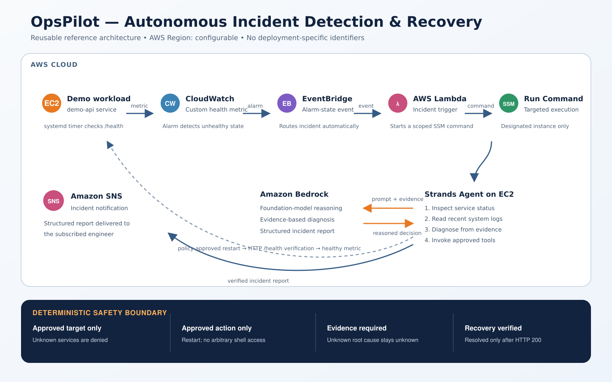

# OpsPilot

**An autonomous, evidence-driven incident response agent for AWS operations.**

OpsPilot detects an unhealthy application, investigates its current state and recent logs, performs only policy-approved remediation, verifies recovery through a real HTTP health check, and produces a structured incident report.



## Why OpsPilot?

Operations teams often spend valuable time acknowledging alerts, checking service state, reading logs, applying a known recovery action, and confirming that the application has recovered. OpsPilot demonstrates how an AI agent can automate that loop while keeping remediation bounded by deterministic safety controls.

The goal is not to give an LLM unrestricted infrastructure access. The goal is to combine agentic reasoning with narrow, auditable tools and explicit operational policy.

## What It Does

1. A `systemd` timer checks the `demo-api` service every minute.
2. The check publishes `DemoApiHealth` to the custom CloudWatch namespace `OpsPilot`.
3. A CloudWatch alarm enters `ALARM` when the metric falls below `1`.
4. EventBridge routes the alarm-state event to an AWS Lambda function.
5. Lambda uses AWS Systems Manager Run Command to start the Strands agent on the designated EC2 instance.
6. The agent checks the service state and reads recent `systemd` logs.
7. It separates the observed failure condition from the underlying root cause and refuses to guess when evidence is insufficient.
8. A deterministic policy permits only the approved restart of `demo-api`.
9. The agent verifies the application through `http://localhost:8000/health`.
10. Amazon SNS delivers the structured incident report to the subscribed engineer.
11. The next healthy metric returns the CloudWatch alarm to `OK`.

## Core Agent Tools

| Tool | Purpose |
| --- | --- |
| `get_service_status` | Reads the current `systemd` state of `demo-api`. |
| `get_recent_logs` | Retrieves the most recent service logs for evidence-based diagnosis. |
| `restart_service` | Enforces the allowlist and performs only an approved restart. |
| `verify_service_health` | Confirms recovery using the internal HTTP health endpoint. |

## Safety Model

OpsPilot uses deterministic controls around the model:

- Only `demo-api` is approved for automatic remediation.
- The only approved remediation action is `restart`.
- Unknown services and unapproved actions are denied.
- Status and recent logs must be collected before remediation.
- A stopped service is reported as a failure condition, not automatically as a root cause.
- If the evidence does not explain why the service stopped, the root cause remains `unknown`.
- An incident is not marked resolved until the HTTP health check returns `200`.
- Lambda's SSM permission is scoped to the designated instance and `AWS-RunShellScript`.
- CloudWatch metric publishing is constrained to the `OpsPilot` namespace.
- The application port is not publicly exposed; health verification occurs locally on EC2.

## AWS Services and Technologies

- Amazon EC2
- Amazon CloudWatch metrics and alarms
- Amazon EventBridge
- AWS Lambda
- AWS Systems Manager Run Command
- Amazon Bedrock Mantle
- Strands Agents SDK
- IAM least-privilege policies
- Python and Bash
- `systemd`
- Amazon SNS

## Repository Structure

```text
opspilot-agent/
├── agent.py
├── lambda_function.py
├── requirements.txt
├── .env.example
├── demo-app/
│   └── app.py
├── docs/
│   ├── opspilot-architecture.png
│   └── opspilot-architecture.svg
├── infrastructure/
│   ├── cloudformation/
│   │   └── opspilot-automation.yaml
│   └── iam/
│       ├── cloudwatch-policy.example.json
│       ├── ec2-agent-ssm-policy.example.json
│       ├── ec2-agent-sns-policy.example.json
│       └── lambda-ssm-policy.example.json
├── monitoring/
│   └── publish_health_metric.sh
├── scripts/
│   ├── deploy-automation.ps1
│   └── list_models.py
├── systemd/
│   ├── demo-api.service
│   ├── opspilot-health.service
│   └── opspilot-health.timer
└── tests/
    ├── test_policy.py
    └── test_ssm.py
```

## Prerequisites

- An AWS account with access to the required Bedrock model
- An EC2 instance with Python 3 and AWS Systems Manager connectivity
- AWS CLI configured for deployment
- IAM permissions for EC2, CloudWatch, EventBridge, Lambda, SSM, and Bedrock
- Python 3.13 recommended

## Configuration

The public source code contains no deployment-specific account, instance, or IP identifiers.

Copy the example configuration and provide your target instance ID:

```bash
cp .env.example .env
```

```text
AWS_REGION=us-east-1
OPSPILOT_INSTANCE_ID=i-xxxxxxxxxxxxxxxxx
OPSPILOT_SNS_TOPIC_ARN=arn:aws:sns:us-east-1:123456789012:OpsPilotIncidentNotifications
```

Do not commit `.env`. It is excluded by `.gitignore`.

Replace the placeholders in the IAM example policies before applying them:

- `<AWS_REGION>`
- `<AWS_ACCOUNT_ID>`
- `<EC2_INSTANCE_ID>`

## Install the Agent on EC2

Create the virtual environment and install dependencies:

```bash
python3 -m venv /home/ec2-user/opspilot-venv
/home/ec2-user/opspilot-venv/bin/pip install -r requirements.txt
```

Place `agent.py` at:

```text
/home/ec2-user/agent.py
```

For a manual invocation, export the instance ID first:

```bash
export OPSPILOT_INSTANCE_ID=i-xxxxxxxxxxxxxxxxx
/home/ec2-user/opspilot-venv/bin/python /home/ec2-user/agent.py
```

## Install the Demo Workload and Health Publisher

```bash
sudo mkdir -p /opt/opspilot
sudo cp demo-app/app.py /opt/opspilot/app.py
sudo cp monitoring/publish_health_metric.sh /opt/opspilot/publish_health_metric.sh
sudo chmod 755 /opt/opspilot/publish_health_metric.sh
sudo cp systemd/demo-api.service /etc/systemd/system/demo-api.service
sudo cp systemd/opspilot-health.service /etc/systemd/system/opspilot-health.service
sudo cp systemd/opspilot-health.timer /etc/systemd/system/opspilot-health.timer
sudo systemctl daemon-reload
sudo systemctl enable --now demo-api
sudo systemctl enable --now opspilot-health.timer
```

Confirm that both components are active:

```bash
systemctl is-active demo-api
systemctl is-active opspilot-health.timer
```

## Deploy the Lambda Trigger

### Recommended: deploy the automation control plane with CloudFormation

For a new deployment using an existing EC2 instance, the included template creates the CloudWatch alarm, EventBridge rule, Lambda function, Lambda execution role, scoped SSM policy, EventBridge target, and Lambda invocation permission:

```powershell
.\scripts\deploy-automation.ps1 -InstanceId i-xxxxxxxxxxxxxxxxx -NotificationEmail you@example.com
```

The optional email recipient must confirm the subscription message sent by AWS before notifications can be delivered. The template is located at:

```text
infrastructure/cloudformation/opspilot-automation.yaml
```

Use unique `LambdaFunctionName`, `AlarmName`, `EventRuleName`, or `NotificationTopicName` parameter values if resources with the defaults already exist. The EC2 workload, agent, health publisher, systemd units, EC2 instance profile, and Bedrock access must be installed first as described above.

### Manual Lambda update

Create the Lambda deployment package:

```powershell
Compress-Archive -Path .\lambda_function.py -DestinationPath .\opspilot-lambda.zip -Force
```

Configure the Lambda environment variables:

```powershell
aws lambda update-function-configuration --function-name OpsPilotAlarmHandler --environment "Variables={OPSPILOT_INSTANCE_ID=i-xxxxxxxxxxxxxxxxx,OPSPILOT_SNS_TOPIC_ARN=arn:aws:sns:us-east-1:123456789012:OpsPilotIncidentNotifications}"
```

Upload the function code:

```powershell
aws lambda update-function-code --function-name OpsPilotAlarmHandler --zip-file fileb://opspilot-lambda.zip
```

The Lambda execution role should include the policy represented by `infrastructure/iam/lambda-ssm-policy.example.json` and the standard basic Lambda logging policy.

## Configure Monitoring and Event Routing

1. Attach the CloudWatch metric policy to the EC2 role.
2. Create a CloudWatch alarm named `OpsPilot-DemoApi-Unhealthy` for:
   - Namespace: `OpsPilot`
   - Metric: `DemoApiHealth`
   - Condition: value lower than `1`
   - Evaluation period: `60` seconds
3. Create an EventBridge rule that matches the alarm entering the `ALARM` state.
4. Set `OpsPilotAlarmHandler` as the rule target.
5. Allow EventBridge to invoke the Lambda function.

## End-to-End Test

Confirm that the application is initially active:

```bash
systemctl is-active demo-api
```

Trigger a controlled incident:

```bash
sudo systemctl stop demo-api
```

Do not restart it manually. After the CloudWatch alarm and EventBridge rule trigger the agent, verify:

```bash
systemctl is-active demo-api
cat /tmp/opspilot-agent.log
```

Expected outcome:

- `demo-api` returns to `active`.
- The report identifies `service stopped/inactive` as the failure condition.
- The root cause remains `unknown` unless supported by evidence.
- The policy-approved restart succeeds.
- Verification reports HTTP `200`.
- Amazon SNS delivers the structured report to the confirmed email subscriber.
- The CloudWatch alarm returns to `OK` after the next healthy metric.

## Current Scope

OpsPilot is a focused hackathon prototype built around one service and one bounded remediation action. It intentionally avoids unnecessary orchestration layers and databases so the agent behavior, evidence trail, and safety model remain easy to understand and demonstrate.

Possible future extensions include human approval for higher-risk actions, additional allowlisted runbooks, persistent incident history, and an optional AgentCore deployment profile.

## License

This project is licensed under the MIT License. See [LICENSE](LICENSE).
